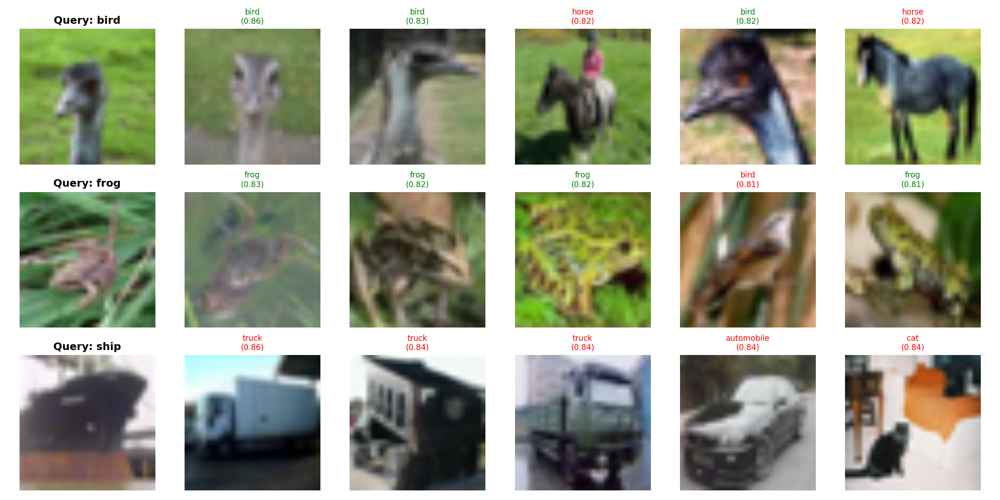

# Image Similarity Search using CNN Embeddings

A content-based image retrieval system that finds visually similar images using deep feature embeddings and fast nearest-neighbor search.

## Overview

This project uses a pretrained ResNet18 (with the classification head removed) as a feature extractor to convert images into 512-dimensional embeddings. A FAISS index enables fast similarity search, retrieving the most visually similar images to a given query from a gallery of stored images.

## Dataset

- **Source:** CIFAR-10
- Gallery: 3,000 randomly sampled training images across 10 object categories
- Queries: 200 test images used for evaluation

## Approach

- Feature extraction: ResNet18 (ImageNet pretrained), final FC layer removed
- Embeddings normalized and indexed using FAISS (Inner Product / cosine similarity search)
- Retrieval evaluated using Precision@5 against ground-truth class labels

## Results

| Metric | Value |
|--------|-------|
| Precision@5 | [insert value] |

Precision@5 measures what fraction of the top-5 retrieved images actually share the same category as the query image.

### Example Queries with Top-5 Retrieved Results

## Tech Stack

- Python, PyTorch, Torchvision
- FAISS (efficient similarity search)
- NumPy, Matplotlib

## How to Run

1. Open the notebook in Google Colab
2. Run cells sequentially
3. CIFAR-10 downloads automatically via torchvision

## Author

Aleena Kainat — AI/ML researcher working in applied deep learning and computer vision
